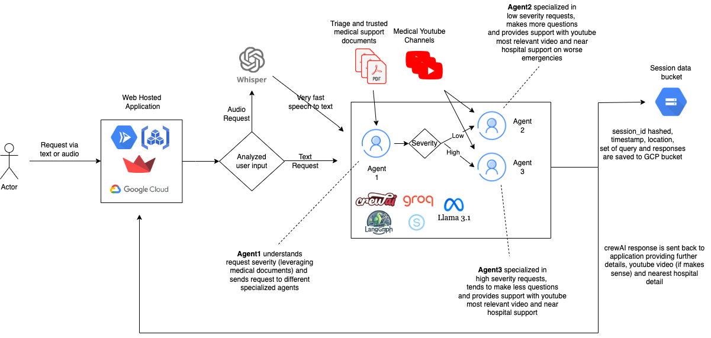

  

# **LLAMA First Aid: leveraging GenAI to provide contextual, step-by-step emergency medical assistance for immediate life-saving response**

 

> *This project secured second place in the LLaMA Impact Rome Hackathon 2024 ([lablab.ai](https://lablab.ai/hackathon-llama-impatto-roma)).*

## Overview
**LLAMA First Aid** is a cutting-edge, web-based assistant designed to provide immediate, step-by-step guidance for first aid during medical emergencies. Powered by **Meta's LLaMA** (Large Language Model Meta AI), this app leverages advanced natural language processing capabilities to understand critical situations and deliver real-time, personalized first aid instructions. Built with **Streamlit**, LLAMA First Aid offers a user-friendly interface that allows anyone—whether trained or not—to respond effectively in a medical emergency.

The name **LLAMA** is not only a fun reference to the friendly, woolly animal but also an acronym that reflects the core purpose of our application. Just like **Meta’s LLaMA** model processes complex language, **LLAMA First Aid** processes emergency situations and generates clear, actionable advice for users in real time.

### The Power of LLaMA Technology in LLAMA First Aid
While **Meta’s LLaMA** refers to one of the most advanced AI language models available, our **LLAMA First Aid** app carries the same acronym. The shared name highlights the synergy between cutting-edge AI and life-saving applications:

- **L**ife-saving  
- **L**ive  
- **A**ssistant  
- **M**edical  
- **A**ssistance  

The acronym **LLAMA** in our app stands for a **Live Assistant for Medical Assistance** designed to save lives during emergencies. In a similar fashion, **Meta’s LLaMA** model processes human language, while **LLAMA First Aid** processes emergency medical data to provide life-saving instructions.

---

## Key Features
- **Real-Time Emergency Assistance**: Powered by **Meta’s LLaMA** AI, LLAMA First Aid provides users with real-time, context-specific advice to handle medical emergencies as they unfold.
- **Step-by-Step Instructions**: LLAMA guides users through critical first aid techniques—such as CPR, choking management, wound care, and more—with clear and easy-to-follow steps.
- **Interactive Protocols**: LLAMA adapts its advice based on the user's responses, offering tailored first aid protocols that fit the exact nature of the emergency.
- **Educational Videos**: For complex medical procedures, LLAMA includes video tutorials, helping users understand and practice key first aid techniques.
- **User-Friendly Interface**: Built with **Streamlit**, the app is intuitive, simple, and easy to use, regardless of the user’s medical knowledge or experience.
- **Custom Agents for Content Relevance**: We have created **custom agents** specifically tailored to the first aid domain, ensuring that the responses generated by **LLaMA** remain focused on providing clear, relevant, and actionable first aid guidance. These agents prevent the model from straying off-topic, optimizing the app’s performance for emergency situations.
- **Multi-Agent Approach for Severity-Based Response**: The system detects the severity of the situation and triggers different agents accordingly. Each agent is specialized for specific emergency scenarios, enabling a more tailored, precise, and effective response. This multi-agent approach ensures that the user receives the most relevant and immediate advice, tailored to the gravity of the problem.
- **Dual Input (Text and Audio)**: Users can interact with the assistant through **text** or **audio**, providing flexibility to respond faster in critical situations. The audio input also helps to ease communication in high-stress scenarios where typing might not be possible.
- **Location-Based Assistance**: The app utilizes the user’s geographical location to suggest nearby hospitals or emergency services, making it easier for the user to act quickly. Depending on the severity of the situation, LLAMA will suggest whether it’s better to contact emergency services or go to the hospital directly. This ensures the user can make an informed decision, optimizing the response time and care.
- **Video Embedding in Web App**: All tutorial videos are directly embedded within the app, ensuring smooth access and no need for external platforms. This guarantees that users can access life-saving video demonstrations instantly without distractions or delays.
- **Saving All Interactions in History**: For each session, **LLAMA First Aid** automatically saves the following data in a **history JSON file**:
    - **session ID**: Unique identifier for each user session.
    - **location**: Geographical location of the user.
    - **timestamp**: The exact time when the session was initiated.
    - **user queries and responses**: A set of all questions and answers exchanged between the user and the assistant during the session.
  
    This data ensures that all interactions are tracked and can be reviewed later, helping improve accuracy and offering insight into previous guidance.

---

## How It Works

### **1. User Interaction**
The user accesses the LLAMA First Aid web application and provides key information about the emergency. LLAMA asks targeted questions to assess the situation and understand the patient's condition (e.g., symptoms, injury type, etc.).

### **2. AI-Driven Assistance**
Using **Meta’s LLaMA** technology, the app processes the user’s responses and interprets the medical context. LLAMA then provides the most appropriate life-saving advice, guiding the user through the necessary actions.

### **3. Agent-Based Response**
LLAMA utilizes a system of **custom agents** to process the information provided by the user. Each agent is designed to handle a specific category of emergency (e.g., CPR, choking, wound care) and ensures the advice given is precise and relevant. These agents collaborate to provide the most appropriate guidance based on the emergency’s nature and severity.

- If the situation is severe (e.g., cardiac arrest), LLAMA activates emergency agents that will prioritize life-saving steps.
- For less critical cases, agents provide guidance that allows the user to handle the situation calmly and effectively.

### **4. Search for the Best Answer**
LLAMA pulls information not only from its internal database but also from external sources such as trusted websites and **YouTube**. This helps to ensure that the guidance provided is always up to date and accurate. By searching multiple sources, LLAMA cross-references information to deliver the best possible advice.

### **5. Step-by-Step Guidance**
For each emergency, LLAMA delivers a structured, easy-to-follow process. Whether it's performing CPR, assisting someone who’s choking, or treating a burn, LLAMA ensures that each step is clearly communicated to reduce confusion and maximize effectiveness.

### **6. Video Tutorials**
For complex tasks that require hands-on learning, LLAMA presents short, clear video tutorials that visually demonstrate first aid techniques, so users can feel confident while performing life-saving procedures.

### **7. Real-Time Adaptation**
As users progress through the app, LLAMA continues to adapt its instructions based on real-time inputs, ensuring that the advice remains relevant and specific to the user’s level of expertise and the situation at hand.

### **8. Hospital Suggestion**
Based on the user's **location**, LLAMA evaluates the severity of the situation and suggests the nearest hospital or emergency service. If the emergency is critical, LLAMA will recommend calling an ambulance or contacting the nearest medical facility directly. In less severe cases, it may suggest the user proceed to the hospital on their own or continue with the first aid steps.

---

## Current Features and Enhancements

- **Dual Input (Text and Audio) for Speed and Efficiency**: At the moment, LLAMA First Aid allows users to interact with the assistant through two input modes: **text** and **audio**. This dual input capability ensures that users can respond quickly and effectively during high-pressure emergencies—whether typing their query or speaking directly into the app. This flexibility speeds up the process and makes the app more efficient for users in stressful situations.

- **Saving All Interactions in History**: For each session, **LLAMA First Aid** automatically saves the following data in a **history JSON file**:
    - **session ID**: Unique identifier for each user session.
    - **location**: Geographical location of the user.
    - **timestamp**: The exact time when the session was initiated.
    - **user queries and responses**: A set of all questions and answers exchanged between the user and the assistant during the session.

    This data ensures that all interactions are tracked and can be reviewed later, helping improve accuracy and offering insight into previous guidance.

---

## Future Features and Expansions

- **Image Upload for Contextual Understanding**: In future updates, LLAMA First Aid will support **image uploads**, allowing users to share photos of the emergency situation (e.g., a wound, injury, or environment). This will help the AI model understand the gravity of the situation better, providing faster and more accurate solutions based on visual data.

- **Evaluation of Response Accuracy**: LLAMA will introduce a feature to **evaluate the correctness of the responses**. Users will be able to rate the quality and usefulness of the advice provided, which will allow LLAMA to continuously improve its accuracy through user feedback.

- **Data Analytics & Alerts**: Future releases will introduce the capability to **analyze historical interaction data**, generating valuable insights through statistics and trend analysis. Additionally, the system will have the potential for **automatic alerts** to external parties (such as medical professionals or emergency contacts) when critical issues are identified, further enhancing the effectiveness of LLAMA First Aid in real-time emergencies.

---

## Why LLAMA First Aid?
- **Immediate Response**: In critical emergencies, LLAMA First Aid provides **instant assistance**, offering users immediate, life-saving guidance.
- **Comprehensive Coverage**: From basic injuries to life